# SFTP Transfer Family with S3

## Overview

This GitHub project aims to provide a comprehensive guide for setting up an SFTP server using AWS Transfer Family with S3 as the storage backend. The project utilizes a custom identity provider with a basic Lambda function that includes hard-coded username and password combinations.

It is important to note that AWS Transfer Family has associated costs. The service is priced at $0.30 per protocol per hour for running the server and $0.04 per GB transferred. Therefore, it is crucial to remember to delete the allocated resources once they are no longer needed. Detailed pricing information can be found [here](https://aws.amazon.com/aws-transfer-family/pricing/).

The environment will be created in the us-east-1 region, and all console links provided in this guide will be specific to that region. If deploying the project in a different region, it is necessary to adjust the region accordingly.

## Instructions

### Stage 1 - Create the Bucket

1. Navigate to the S3 dashboard by clicking [here](https://s3.console.aws.amazon.com/s3/buckets?region=us-east-1).
2. Click on the "Create bucket" button.
3. Set the **Bucket Name** as "sftp-bucket-\<account id\>". Retrieve your account ID from the top right dropdown menu.
   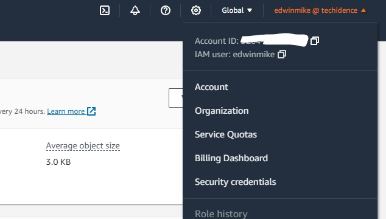
4. Select the desired region (us-east-1 or the appropriate region for deployment).
5. Leave all other settings as default and click "Create bucket".

### Stage 2 - Create the IAM Roles

1. Go to the IAM console by clicking [here](https://us-east-1.console.aws.amazon.com/iamv2/home?region=us-east-1#/roles).
2. On the Roles page, click on the "Create role" button.
3. Set the **Trusted entity type** to "AWS Service", and choose "Transfer" as the **Use Case**. Check the box for "Transfer" and click "Next".
   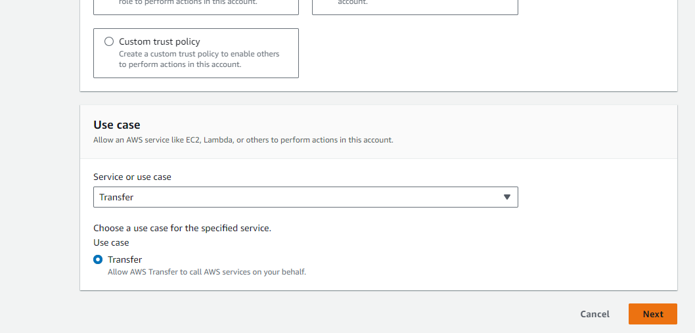
4. Under **Add Permissions**, search for and select "AmazonS3FullAccess".
	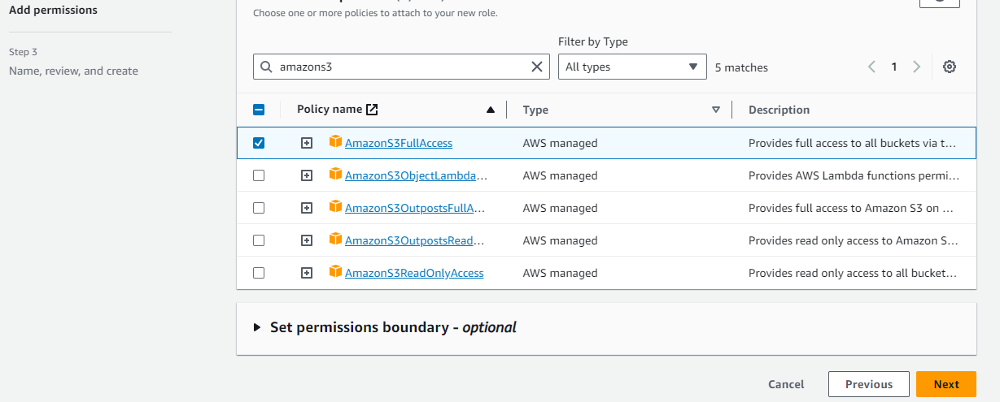
5. Click "Next".
6. Set the **Role name** as "transfer-family-s3-role".
7. Click "Create role".
8. Repeat the above steps to create another role:
   - Set the **Trusted entity type** to "AWS Service".
   - Set the **Use Case** to "Transfer" and click "Next".
   - Under **Add Permissions**, search for and select "AWSTransferLoggingAccess".
   - Set the **Role name** as "transfer-family-logging-role".
   - Click "Create role".

### Stage 3 - Create the Authentication Lambda

1. Access the Lambda console by clicking [here](https://us-east-1.console.aws.amazon.com/lambda/home?region=us-east-1#/functions).
2. Click on the "Create function" button.
3. Keep the "Author from scratch" option selected.
4. Set the **Function name** as "sftp-auth-function".
5. Choose "Python 3.9" as the **Runtime**.
6. Leave the **Architecture** as "x86_64".
7. Click "Create function".
8. In the **Code** tab, paste the provided Python code:

```python
def lambda_handler(event, context):
    username_db = ['gerrard:liverpool', 'lampard:chelsea', 'scholes:manutd']
    accountid = context.invoked_function_arn.split(":")[4]
    ftp_role = f"arn:aws:iam::{accountid}:role/transfer-family-s3-role"
    bucketname = f"sftp-bucket-{accountid}"
    
    username = event['username']
    password = event['password']
    
    for user in username_db:
        if user.split(':')[0] == username and user.split(':')[1] == password:
            return {
               "Role": ftp_role,
               "HomeDirectoryType": "LOGICAL",
               "HomeDirectoryDetails": str([{"Entry": "/", "Target": f"/{bucketname}/{username}"}])
            }
    return {}
```
   It is worth noting that in a production environment, it is advisable to validate the username/password against an external identity source. Additionally, SSH key authentication can be used for SFTP authentication. However, for the purpose of this demonstration, a static username/password list is utilized.

9. The provided code utilizes logical directory mappings, which enables users to perceive the "root" (`/`) directory as their home directory while actually utilizing `/<bucket>/<username>` in the backend. This simplifies the user experience, as they do not need to explicitly change directory into their home directory.
   Further details on logical directory mappings can be found [here](https://docs.aws.amazon.com/transfer/latest/userguide/logical-dir-mappings.html).

10. Click "Deploy" to save the function.
    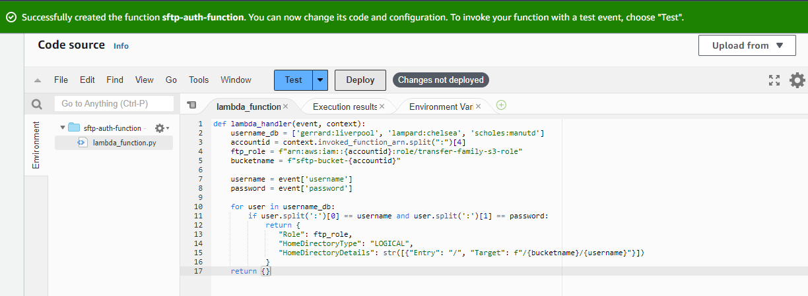

11. To grant permission for the Transfer Family server to invoke the function, go to the **Configuration** tab and then select **Permissions**. Scroll down to **Resource-based policy statements** and click "Add permissions".
12. Select **AWS Service** and choose "Other" from the dropdown.
    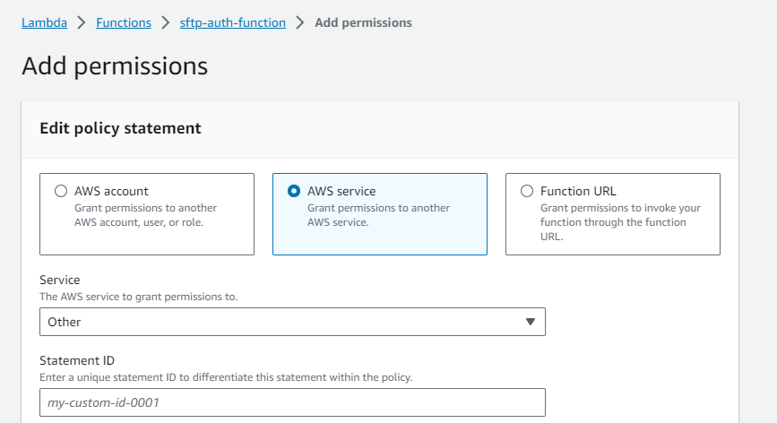
13. Enter any desired text for **Statement ID** (e.g., "statement1").
14. Set the **Principal** as `transfer.amazonaws.com`.
15. Set the **Source ARN** as `arn:aws:transfer:<region>:\<account id\>:server/*`. Retrieve your account number and current region from the top right of the AWS Console.
16. Set the **Action** as `lambda:InvokeFunction`.
    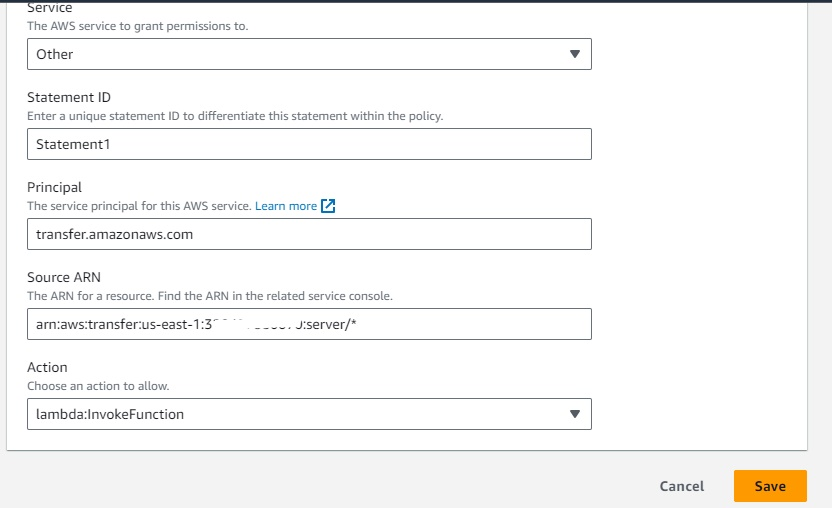
17. Click "Save".

## Stage 3 - Setting Up the Transfer Family Server

To begin setting up the Transfer Family server, please follow these steps:

1. Access the AWS Transfer Family console by navigating to [https://us-east-1.console.aws.amazon.com/transfer/home?region=us-east-1#/](https://us-east-1.console.aws.amazon.com/transfer/home?region=us-east-1#/) in your web browser.
2. Click on the "Create Server" button.
3. In the "Select the protocols you want to enable" section, choose "SFTP" as the protocol. We opt for SFTP because FTPS requires an ACM certificate for domain association, and unencrypted FTP is not supported by Transfer Family for public endpoints. SFTP is suitable for this demonstration.
4. Click "Next" to proceed.
5. In the "Identity Provider Type" section, select "Custom Identity Provider".
6. From the dropdown menu labeled "AWS Lambda function", choose the previously created Lambda function named "sftp-auth-function".
7. Click "Next" to continue.

	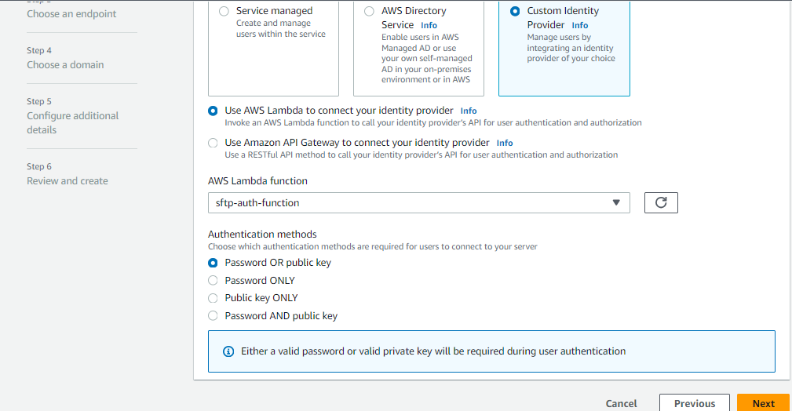

8. Keep the "Endpoint type" set to "Publicly accessible".
9. Click "Next" to proceed.
10.	Leave the "Domain" option as "Amazon S3".
11. Click "Next" to continue.
12. For the "Logging role" configuration, select the option "Choose an existing role". Then, choose "transfer-family-logging-role" from the list of available roles.

13. Modify the "Security policy" to use "TransferSecurityPolicy-2022-03".

	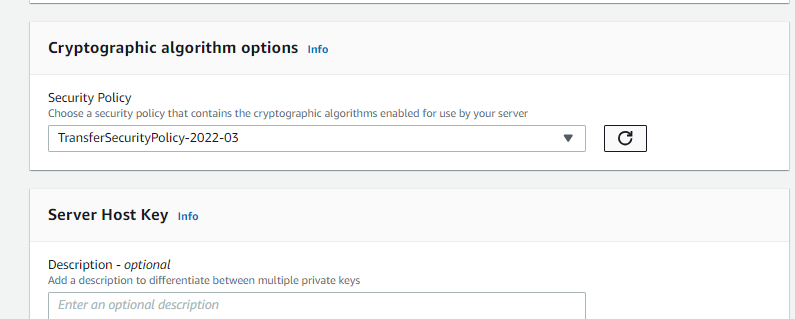

14. Click "Next" to proceed.
15. Finally, click on the "Create server" button.

The creation of the Transfer Family server will take a few minutes.

## Stage 4 - Testing the Setup

To test the newly created Transfer Family server, follow these steps:

1. We recommend using FileZilla, a widely available SFTP client for Windows, Mac, and Linux. However, feel free to use any SFTP program you prefer, including the command line if you are comfortable with it.
   You can download FileZilla from [https://filezilla-project.org/](https://filezilla-project.org/).

2. Go to the Transfer Family console by visiting [https://us-east-1.console.aws.amazon.com/transfer/home?region=us-east-1#/servers](https://us-east-1.console.aws.amazon.com/transfer/home?region=us-east-1#/servers) in your web browser.
3. Select your server from the list and take note of the "Endpoint" displayed.

	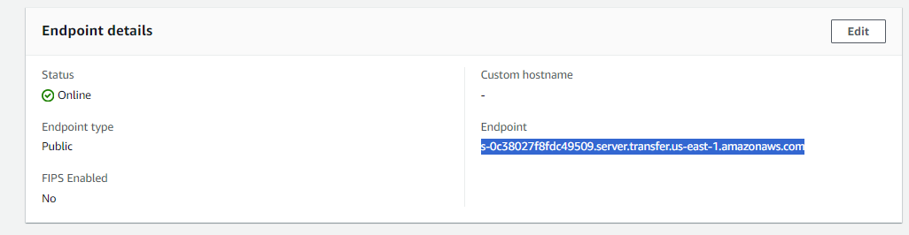

4. Launch FileZilla and enter `sftp://<endpoint>` in the Host field, where `<endpoint>` is the previously noted server endpoint. Use any of the usernames provided by the Lambda function, along with the respective password. Leave the port field empty. For example, if using `gerrard` as the username and `liverpool` as the password:

	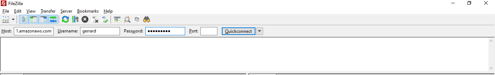

5. When prompted, a window will appear asking if you want to trust the public key of the AWS Transfer Family server. Click on "Always trust this host" and then select "OK".

	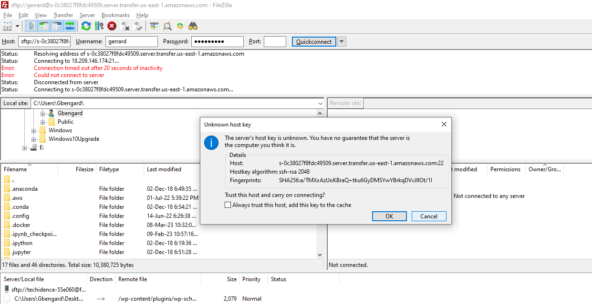

6. The FileZilla interface should now display a successful connection to the Transfer Family endpoint. You will also see a listing of the `/` directory, which, due to the use of logical directory mappings, represents `/<bucket>/<username>/`.

7. Let's proceed by uploading a file. Feel free to choose any file you wish. Simply click and drag the selected file to the right side of the FileZilla interface (server side).

	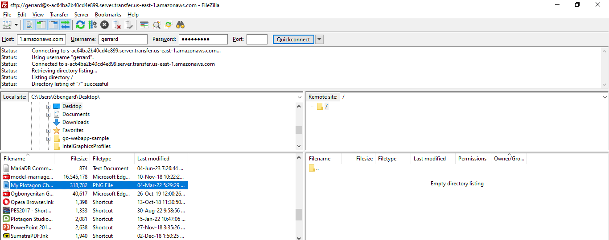

8. You should see in the logs that the upload or file transfer process was successful:

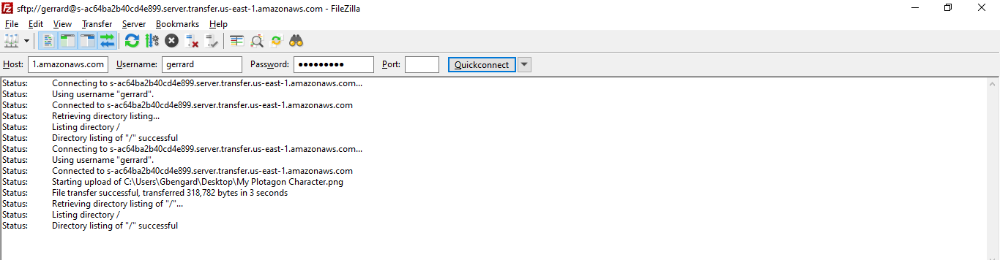

9. Now, let's verify the presence of the uploaded file in the corresponding S3 bucket. Go to the S3 console and navigate to your "sftp-bucket-\<account id\>" bucket at [https://s3.console.aws.amazon.com/s3/buckets?region=us-east-1&region=us-east-1](https://s3.console.aws.amazon.com/s3/buckets?region=us-east-1&region=us-east-1).
   Inside the bucket, you will find a directory with the same name as the username you used. Access that directory to locate the uploaded file.

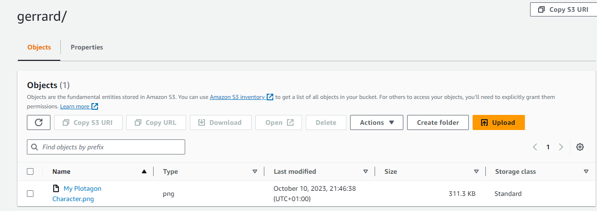

Congratulations! You have completed the setup successfully. Feel free to explore further possibilities, such as using different users, directly uploading files to S3, downloading files using the SFTP server, or conducting any other experiments of your choice.

## Stage 5 - Optional: Monitoring SFTP Logs

**This stage is optional but provides valuable insights into the number of malicious login attempts targeted at our SFTP server.**

SSH (Secure Shell) and SFTP (SSH File Transfer Protocol) are commonly subjected to port scanning and login attacks. If you have ever configured a Linux server accessible to the public with SSH listening on port 22, you are likely familiar with the frequent login attempts by attackers.

1.	To examine the SFTP logs for our server, navigate to the CloudWatch Logs console: [https://us-east-1.console.aws.amazon.com/cloudwatch/home?region=us-east-1#logsV2:log-groups](https://us-east-1.console.aws.amazon.com/cloudwatch/home?region=us-east-1#logsV2:log-groups)

2.	Locate the log group named "/aws/transfer/<server ID>" and click on it. Then, select the "ERRORS" log stream.

	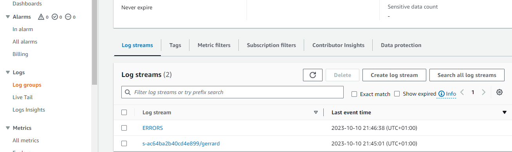

In just approximately 5 minutes since the server has been operational, we have observed over two login attempts from various IP addresses:

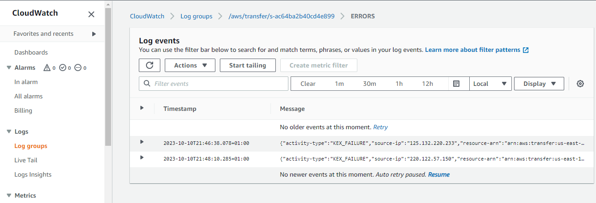

Note that the log messages indicate the absence of a matching key exchange method, which is a result of selecting the "TransferSecurityPolicy-2022-03" as the **Security policy** during the configuration of the Transfer Family server. Consequently, Transfer Family only permits the use of newer and more secure encryption algorithms. Many login attempts employ outdated and less secure algorithms to accommodate a wider range of SSH/SFTP servers.

3.	Now, let's reduce the level of our **Security policy** on the SFTP Server and observe the outcomes.

4.	Proceed to the Transfer Family console: [https://us-east-1.console.aws.amazon.com/transfer/home?region=us-east-1#/servers](https://us-east-1.console.aws.amazon.com/transfer/home?region=us-east-1#/servers)

5.	Select your server and click <kbd>Edit</kbd> under **Additional Details**.

	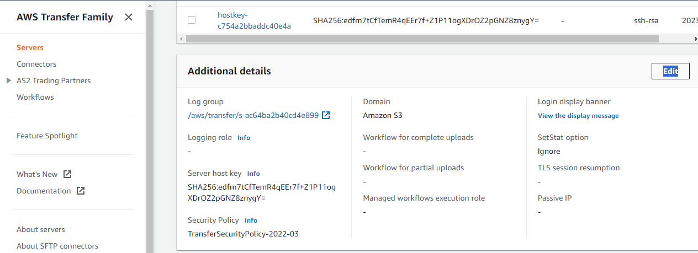

6.	Modify the **Security Policy** to "TransferSecurityPolicy-2018-11".

	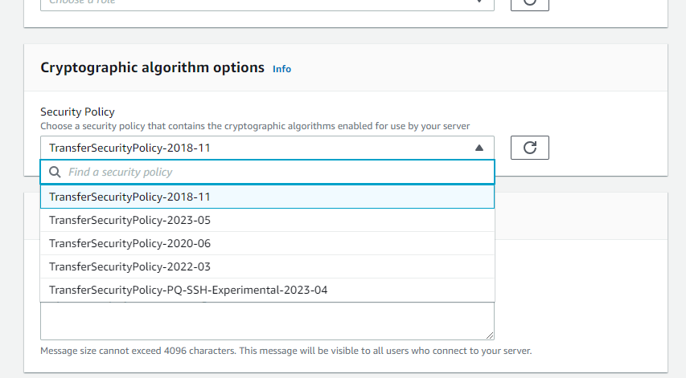

7.	Click <kbd>Save</kbd>.

After a few minutes, when reviewing the "ERRORS" log, we can observe that the login attempts progress further into the process. They establish a connection and proceed to attempt logins using common usernames and passwords:

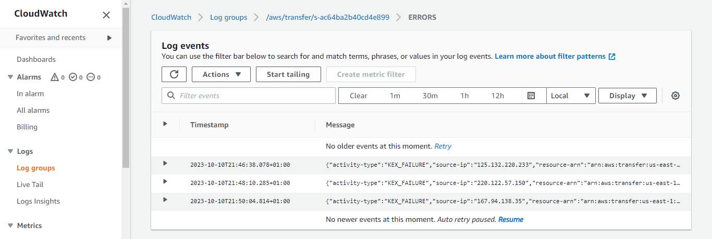

This emphasizes the significance of securing your SFTP server, ideally by restricting access to your Virtual Private Cloud (VPC) and utilizing a Client or Site-to-Site VPN for accessing the SFTP server. Alternatively, it is recommended to use SSH **keys** instead of relying on usernames and passwords.

## Stage 5 - Cleanup Process

1.	Access the S3 console: [https://s3.console.aws.amazon.com/s3/buckets?region=us-east-1&region=us-east-1](https://s3.console.aws.amazon.com/s3/buckets?region=us-east-1&region=us-east-1)

2.	Select your SFTP bucket and click <kbd>Empty</kbd>.

	

3.	Enter "*permanently delete"* in the confirmation window and click <kbd>Empty</kbd>.

4.	Next, choose your SFTP bucket and click <kbd>Delete</kbd>.

	

5.	Enter the bucket name in the confirmation window and click <kbd>Delete</kbd>.

6.	Navigate to the Lambda console: [https://us-east-1.console.aws.amazon.com/lambda/home?region=us-east-1#/functions](https://us-east-1.console.aws.amazon.com/lambda/home?region=us-east-1#/functions)

7.	Select the "sftp-auth-function" and choose Actions → Delete.

	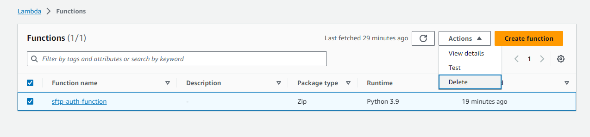

8.	Enter "delete" in the confirmation window and click <kbd>Delete</kbd>.

9.	Access the IAM console: [https://us-east-1.console.aws.amazon.com/iamv2/home?region=us-east-1#/roles](https://us-east-1.console.aws.amazon.com/iamv2/home?region=us-east-1#/roles)

10.	Under **Roles**, search for "transfer-family".

11.	Select the previously created roles and click <kbd>Delete</kbd>.

	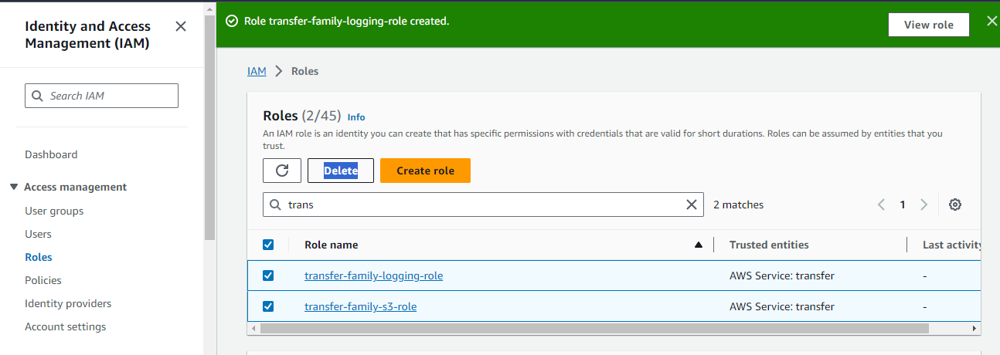

12.	Enter "delete" in the confirmation field and click <kbd>Delete</kbd>.

13.	Navigate to the CloudWatch Logs console: [https://us-east-1.console.aws.amazon.com/cloudwatch/home?region=us-east-1#logsV2:log-groups](https://us-east-1.console.aws.amazon.com/cloudwatch/home?region=us-east-1#logsV2:log-groups)

14.	Search for the "transfer" Log Group.

15.	Choose the log group that matches your server ID (it should be the only one) and click <kbd>Actions</kbd> → <kbd>Delete</kbd>.

	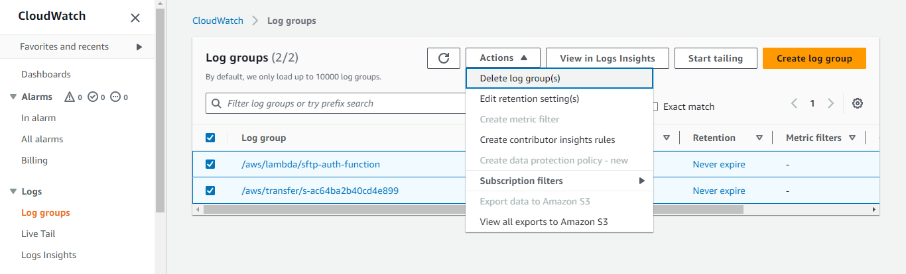

16.	In the confirmation popup, click <kbd>Delete</kbd>.

17.	Access the Transfer Family console: [https://us-east-1.console.aws.amazon.com/transfer/home?region=us-east-1#/servers](https://us-east-1.console.aws.amazon.com/transfer/home?region=us-east-1#/servers)

18.	Select your server and click <kbd>Actions</kbd> → <kbd>Delete</kbd>.

	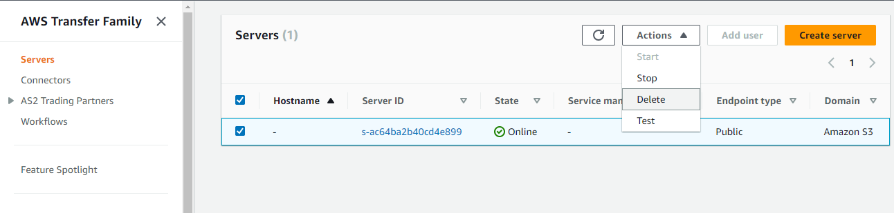

19.	Enter "delete" in the confirmation box that appears.
